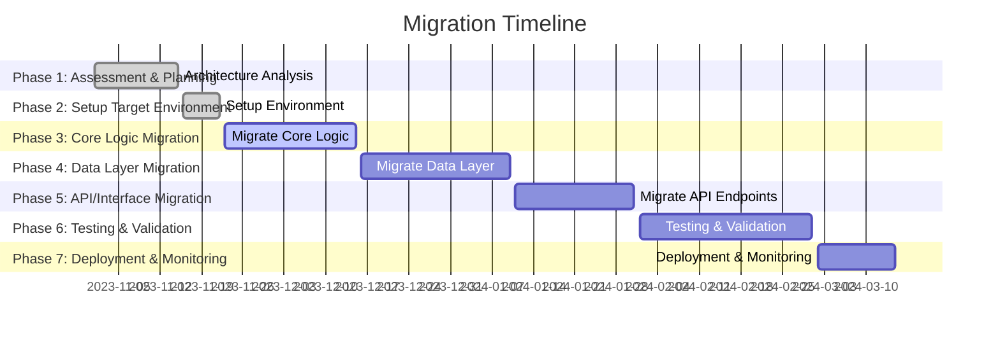

# MIGRATION_PLAN.md

## 1. Executive Summary
This document outlines a comprehensive plan to migrate the `repository` codebase from C# to Java. The migration is necessitated by business requirements for improved compatibility with Java-based systems, reduced licensing costs, and leveraging Java's ecosystem. The migration will preserve existing functionality, ensure performance parity, and minimize downtime.

The migration will follow a structured, phased approach to ensure all components—from core logic to APIs—are carefully transitioned. Each phase includes detailed tasks, risk assessments, and validation steps to ensure a smooth transition.

---

## 2. Migration Strategy Overview
The migration will follow seven primary steps:
1. **Assessment & Planning**: Analyze the current system and dependencies, and establish a detailed migration roadmap.
2. **Setup Target Environment**: Prepare a new Java-based development environment and project structure.
3. **Core Logic Migration**: Translate the core business logic to Java while ensuring functional parity.
4. **Data Layer Migration**: Migrate database models and queries to Java-compatible ORM frameworks.
5. **API/Interface Migration**: Convert API endpoints, routing, and middleware functionality.
6. **Testing & Validation**: Validate the migrated system through rigorous testing.
7. **Deployment & Monitoring**: Deploy the migrated system to production and set up monitoring.

---

## 3. Detailed Breakdown of Each Migration Step

### ### Step 1: Assessment & Planning
**Description:** Analyze the current system, establish a migration strategy, and define key milestones.

#### Tasks:
1. **Document Current Architecture**: Map out the current system architecture, including services, modules, and dependencies.
2. **List All Dependencies**: Inventory all third-party libraries and tools used in the C# codebase.
3. **Identify Critical Components**: Highlight business-critical modules for prioritization.

#### Technical Requirements:
- Tool: Architecture documentation tools (e.g., C4 Model, Lucidchart).
- Input: Existing documentation, codebase analysis tools (e.g., SonarQube).

#### Deliverables:
- Architecture documentation.
- Dependency inventory.
- Migration roadmap.

#### Risk Assessment:
| **Risk**              | **Impact** | **Probability** | **Mitigation**                               |
|-----------------------|------------|-----------------|---------------------------------------------|
| Missing dependencies  | High       | Medium          | Thorough dependency analysis.               |
| Underestimated effort | High       | Medium          | Detailed task breakdown and buffer time.    |

---

### Step 2: Setup Target Environment
**Description:** Establish the foundational project structure and development environment for Java.

#### Tasks:
1. **Install Java Development Environment**: Install JDK 17 or later, Maven/Gradle, IDE (e.g., IntelliJ IDEA).
2. **Setup Project Structure**: Create a modular Java project structure reflecting the C# architecture.
3. **Configure Build Tools**: Set up Maven or Gradle for dependency management and builds.

#### Technical Requirements:
- Tool: JDK 17+, Maven or Gradle, Docker.
- Input: Current project structure for guidance.

#### Deliverables:
- Initialized Java project.
- Configured build tool with dependencies.

#### Risk Assessment:
| **Risk**              | **Impact** | **Probability** | **Mitigation**                               |
|-----------------------|------------|-----------------|---------------------------------------------|
| Misaligned structure  | Medium     | Low             | Review Java best practices for architecture.|

---

### Step 3: Core Logic Migration
**Description:** Translate core business logic, ensuring it aligns with Java syntax and conventions.

#### Tasks:
1. **Translate Core Functions**: Convert C# methods and classes into equivalent Java code.
2. **Adapt Data Structures**: Replace C#-specific data structures (e.g., `Dictionary`) with Java alternatives (`Map`).
3. **Port Algorithms**: Rewrite algorithms and ensure they produce identical results.

#### Technical Requirements:
- Tool: IntelliJ IDEA, automated code converters (e.g., Sharpen).

#### Deliverables:
- Fully translated core logic modules.

#### Risk Assessment:
| **Risk**              | **Impact** | **Probability** | **Mitigation**                               |
|-----------------------|------------|-----------------|---------------------------------------------|
| Logic divergence      | High       | Medium          | Peer reviews and automated tests.           |

---

### Step 4: Data Layer Migration
**Description:** Migrate database schema and queries to Java-compatible frameworks.

#### Tasks:
1. **Port Database Schema**: Define the schema using tools like Hibernate.
2. **Convert ORM/Queries**: Replace Entity Framework with Hibernate or JPA.
3. **Migrate Data Access Layer**: Rewrite repository classes for database interactions.

#### Technical Requirements:
- Tool: Hibernate, MySQL Java Connector.

#### Deliverables:
- Java-based data access layer.

#### Risk Assessment:
| **Risk**              | **Impact** | **Probability** | **Mitigation**                               |
|-----------------------|------------|-----------------|---------------------------------------------|
| Data model mismatch   | High       | Medium          | Validate schema with test data.             |

---

### Step 5: API/Interface Migration
**Description:** Migrate API endpoints and routing.

#### Tasks:
1. **Port API Routes**: Use Spring Boot for API routing.
2. **Convert Request/Response Handlers**: Translate controllers to Java.
3. **Adapt Middleware**: Recreate middleware functionality in Java.

#### Technical Requirements:
- Tool: Spring Boot, Postman for testing.

#### Deliverables:
- Fully functional Java-based APIs.

#### Risk Assessment:
| **Risk**              | **Impact** | **Probability** | **Mitigation**                               |
|-----------------------|------------|-----------------|---------------------------------------------|
| API behavior change   | High       | Low             | Write integration tests.                    |

---

### Step 6: Testing & Validation
**Description:** Test all migrated components.

#### Tasks:
1. **Write/Port Unit Tests**: Use JUnit to port existing tests.
2. **Integration Testing**: Validate end-to-end functionality.
3. **Performance Testing**: Compare performance metrics with the C# system.

#### Technical Requirements:
- Tool: JUnit, TestContainers, Apache JMeter.

#### Deliverables:
- Test coverage report.

#### Risk Assessment:
| **Risk**              | **Impact** | **Probability** | **Mitigation**                               |
|-----------------------|------------|-----------------|---------------------------------------------|
| Missed edge cases     | High       | Medium          | Comprehensive test plan.                    |

---

### Step 7: Deployment & Monitoring
**Description:** Deploy the migrated system and monitor its performance.

#### Tasks:
1. **Setup CI/CD**: Configure Jenkins or GitHub Actions for automated builds.
2. **Deploy to Staging**: Test deployment in a staging environment.
3. **Monitor and Optimize**: Use tools like Prometheus for monitoring.

#### Technical Requirements:
- Tool: Docker, Prometheus, Grafana.

#### Deliverables:
- Deployed Java application.

#### Risk Assessment:
| **Risk**              | **Impact** | **Probability** | **Mitigation**                               |
|-----------------------|------------|-----------------|---------------------------------------------|
| Deployment failure    | High       | Low             | Use blue-green deployment strategy.         |

---

## 4. Timeline and Milestones

---

## 5. Resource Requirements
- **Team**: 3 developers, 1 QA engineer, 1 project manager.
- **Tools**: IntelliJ IDEA, Spring Boot, Hibernate, JUnit, Docker, Prometheus.
- **Hardware**: Staging server with Java runtime support.

---

## 6. Success Criteria and Metrics
- **Functional Parity**: 100% of features replicated in Java.
- **Performance Metrics**: No more than 5% deviation in response times.
- **Code Quality**: Maintainable and modular Java codebase.

---

## 7. Rollback Procedures
- Maintain the C# codebase during the migration.
- Use feature toggles to revert to the C# system if issues arise.

---

## 8. Post-Migration Validation Checklist
- [ ] All unit tests pass (C# and Java parity).
- [ ] No critical bugs in staging.
- [ ] Performance benchmarks met.
- [ ] Monitoring systems in place.

--- 

This plan provides a clear, actionable roadmap for the migration from C# to Java, ensuring minimal disruption and maximum efficiency.