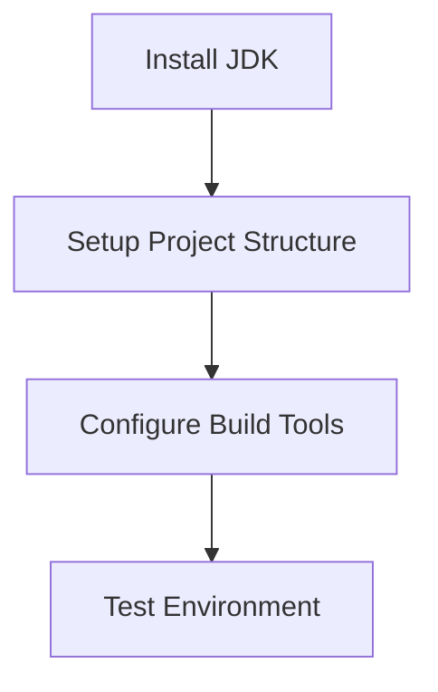

# Migration Step 2: Setup Target Environment

## **Step Overview and Objectives**
### Objective:
Prepare a development environment that supports Java, allowing seamless migration of a C# application to Java. This step ensures the target environment is well-configured to foster efficient development, testing, and deployment of the migrated application.

---

## **Prerequisites and Dependencies**
Before starting, ensure the following:
1. **Repository Access**:
   - Clone the existing C# repository locally. This will be required for mapping functionality during migration.
   - Example:
     ```bash
     git clone https://your-repository-url.git
     cd repository
     ```
2. **Java Development Kit (JDK)**:
   - Install JDK version 11 or higher. Java 11 is the current long-term support version, while Java 17 offers newer features.
3. **Integrated Development Environment (IDE)**:
   - Install an IDE like IntelliJ IDEA (recommended for Java) or Eclipse.
4. **Build Tools**:
   - Gradle or Maven for dependency management and build automation.
5. **Java Framework**:
   - Select a suitable framework based on the project needs. For example:
     - Spring Boot for web apps.
     - Jakarta EE for enterprise applications.
6. **Basic Knowledge**:
   - Familiarity with Java syntax and tooling.

---

## **Detailed Implementation Instructions**
Follow these steps to set up the target environment in Java.

---

### 1. **Install the Java Development Kit (JDK)**

#### **Instructions**:
1. Visit the [Oracle JDK Downloads page](https://www.oracle.com/java/technologies/javase-downloads.html) or the [OpenJDK site](https://openjdk.org/install/).
2. Download the appropriate installer for your OS (Windows, macOS, or Linux).
3. Install the JDK following the instructions provided during the installation process.
4. Verify the installation:
   ```bash
   java -version
   ```
   Example output for Java 17:
   ```
   java version "17.0.x"
   Java(TM) SE Runtime Environment (build 17.0.x+xx)
   Java HotSpot(TM) 64-Bit Server VM (build 17.0.x+xx, mixed mode)
   ```

#### **Time Estimate**: 10-15 minutes

---

### 2. **Setup Project Structure**

#### **Instructions**:
1. Open your preferred IDE (e.g., IntelliJ IDEA).
2. Create a new Java project:
   - **IntelliJ IDEA**: 
     - File → New Project → Select **Java** → Choose JDK → Next → Finish.
   - **Eclipse**:
     - File → New → Java Project → Select JDK → Finish.
3. Define a recommended Maven or Gradle project structure:
   ```
   repository/
   ├── src/
   │   ├── main/
   │   │   ├── java/         # Java source files
   │   │   ├── resources/    # Application configuration
   │   ├── test/
   │   │   ├── java/         # Unit tests
   │   │   ├── resources/    # Test configuration
   ├── pom.xml (if Maven)
   ├── build.gradle (if Gradle)
   ├── README.md
   ├── .gitignore
   ```
4. Initialize the project repository in Git:
   ```bash
   git init
   git remote add origin https://your-repository-url.git
   git add .
   git commit -m "Initial Java project setup"
   git push origin main
   ```

#### **Time Estimate**: 20-30 minutes

---

### 3. **Configure Build Tools**

#### **Instructions**:
1. **Maven**:
   - Create the `pom.xml` file in the project root directory:
     ```xml
     <project xmlns="http://maven.apache.org/POM/4.0.0" xmlns:xsi="http://www.w3.org/2001/XMLSchema-instance"
         xsi:schemaLocation="http://maven.apache.org/POM/4.0.0 http://maven.apache.org/xsd/maven-4.0.0.xsd">
         <modelVersion>4.0.0</modelVersion>
         <groupId>com.example</groupId>
         <artifactId>repository</artifactId>
         <version>1.0-SNAPSHOT</version>
         <dependencies>
             <!-- Example: Add Spring Boot dependencies -->
             <dependency>
                 <groupId>org.springframework.boot</groupId>
                 <artifactId>spring-boot-starter</artifactId>
                 <version>3.0.0</version>
             </dependency>
         </dependencies>
     </project>
     ```

2. **Gradle**:
   - Create the `build.gradle` file in the project root directory:
     ```groovy
     plugins {
         id 'java'
         id 'org.springframework.boot' version '3.0.0'
     }

     group = 'com.example'
     version = '1.0-SNAPSHOT'

     repositories {
         mavenCentral()
     }

     dependencies {
         implementation 'org.springframework.boot:spring-boot-starter'
     }
     ```

3. Validate the build tool setup:
   - For Maven:
     ```bash
     mvn clean install
     ```
   - For Gradle:
     ```bash
     gradle build
     ```

---

#### **Time Estimate**: 15-20 minutes

---

## **Code Examples and Snippets**
### Example: Main Application Entry Point
```java
package com.example.repository;

public class Application {
    public static void main(String[] args) {
        System.out.println("Migration setup complete. Ready for development.");
    }
}
```

---

## **Common Pitfalls and How to Avoid Them**
1. **Incorrect JDK Version**:
   - Make sure to install JDK 11 or higher. Older versions might not support modern frameworks.
2. **Mismatched Project Structure**:
   - Follow the recommended project structure to avoid confusion during migration.
3. **Dependency Conflicts**:
   - Use dependency management tools like Maven or Gradle to resolve library conflicts.

---

## **Testing Checklist**
- [ ] Verify JDK installation (`java -version`).
- [ ] Ensure the IDE can compile and run the Java project.
- [ ] Confirm that Maven or Gradle builds successfully (`mvn clean install` or `gradle build`).
- [ ] Run the `Application.java` entry point and verify that it executes without errors.

---

## **Validation Criteria**
- The Java environment is fully set up, with a working project structure and build tool configuration.
- The IDE can compile and debug Java code effectively.
- Dependencies are resolved without errors.

---

## **Troubleshooting Guide**
### Issue: `java` command not found.
- **Resolution**: Add the JDK `bin` directory to your system's `PATH` environment variable.

### Issue: Maven or Gradle fails to build.
- **Resolution**: Check the build file syntax and ensure all dependencies are correctly specified.

---

## **Resources and References**
- [Spring Boot Documentation](https://spring.io/projects/spring-boot)
- [Maven Documentation](https://maven.apache.org/guides/index.html)
- [Gradle Documentation](https://docs.gradle.org/current/userguide/userguide.html)
- [OpenJDK Installation Guide](https://openjdk.org/install/)

---

## **Next Steps**
1. **Step 3: Map Core Functionality**:
   - Begin analyzing and mapping core functionality from the C# application to Java.
2. Ensure alignment with team members regarding framework choices and project goals.

---

### **Diagram: High-Level Target Environment Setup**
