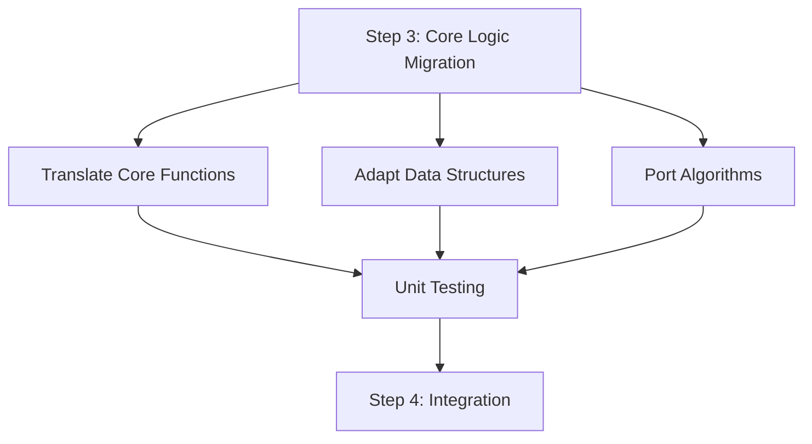

# Migration Guide: Step 3 - Core Logic Migration

## Overview and Objectives

In **Step 3: Core Logic Migration**, we focus on translating the core business logic, algorithms, and data structures from C# to Java. This step is critical as it ensures that the application's main functionality is preserved and behaves as expected in the target language. The goal is to maintain functional parity while leveraging Java's idioms and best practices.

---

## Prerequisites and Dependencies

Before starting this step, ensure the following:

1. **Environment Setup**  
   - Java Development Kit (JDK) installed (version 11+ recommended).
   - An IDE configured for Java (e.g., IntelliJ IDEA, Eclipse).

2. **Codebase Access**  
   - Access to the C# source code repository.
   - A Java repository created and initialized for the migrated code.

3. **Dependency Compatibility**  
   - Identify third-party libraries used in the C# code.
   - Find equivalent Java libraries or plan for custom implementation where no direct equivalent exists.

4. **Preparation from Previous Steps**  
   - Ensure foundational elements like project structure, dependency management, and basic configurations are already migrated to Java (from Step 2).

---

## Detailed Implementation Instructions

### 1. **Translate Core Functions**
   - Analyze the functionality of the C# methods.
   - Translate them to Java while adhering to Java conventions.

#### Example: Translating a Simple C# Function
**C# Code**:
```csharp
public int AddNumbers(int a, int b)
{
    return a + b;
}
```

**Java Equivalent**:
```java
public int addNumbers(int a, int b) {
    return a + b;
}
```

**Key Notes**:
- Use camelCase for Java method names.
- Explicitly define data types (Java does not have `var` for method parameters).

---

### 2. **Adapt Data Structures**
   - Identify C# data structures and replace them with corresponding Java equivalents.  
   - Use Java's standard library or custom implementations as needed.

#### Common C# to Java Data Structure Mappings:
| C# Data Structure      | Java Equivalent                     |
|-------------------------|-------------------------------------|
| `List<T>`              | `ArrayList<T>` or `LinkedList<T>`   |
| `Dictionary<K,V>`      | `HashMap<K,V>`                      |
| `HashSet<T>`           | `HashSet<T>`                       |
| `Queue<T>`             | `Queue<T>` (via `LinkedList`)       |
| `Stack<T>`             | `Stack<T>`                         |

**Example: Translating a Dictionary**
**C# Code**:
```csharp
Dictionary<string, int> scores = new Dictionary<string, int>();
scores["Alice"] = 95;
scores["Bob"] = 85;
```

**Java Equivalent**:
```java
Map<String, Integer> scores = new HashMap<>();
scores.put("Alice", 95);
scores.put("Bob", 85);
```

---

### 3. **Port Algorithms**
   - Analyze C# algorithms for control flow, recursion, loops, etc.
   - Translate the logic to Java while maintaining the same efficiency.

#### Example: Recursive Factorial Function
**C# Code**:
```csharp
public int Factorial(int n)
{
    if (n <= 1)
        return 1;
    return n * Factorial(n - 1);
}
```

**Java Equivalent**:
```java
public int factorial(int n) {
    if (n <= 1) {
        return 1;
    }
    return n * factorial(n - 1);
}
```

**Key Notes**:
- Ensure proper handling of recursion limits in Java (stack size may differ between C# and Java).

---

## Common Pitfalls and How to Avoid Them

1. **Data Type Mismatches**  
   - **Issue**: C# supports unsigned types (e.g., `uint`, `ulong`), which Java lacks.  
   - **Solution**: Use `long` in Java for large integers and handle overflow explicitly.

2. **Null Handling**  
   - **Issue**: Java's `NullPointerException` is more prominent than C#'s null handling.
   - **Solution**: Use `Optional` where applicable and add null checks.

3. **String Handling**  
   - **Issue**: C# has built-in string interpolation (`$"Hello {name}"`), which Java lacks.  
   - **Solution**: Use `String.format` or concatenation in Java.

4. **Case Sensitivity**  
   - **Issue**: Method and variable naming conventions differ between C# (PascalCase) and Java (camelCase).  
   - **Solution**: Follow Java naming conventions consistently.

---

## Testing Checklist for This Step

- [ ] Verify that all translated methods produce the same outputs as their C# counterparts.
- [ ] Perform unit testing for each migrated function using JUnit (or equivalent).  
- [ ] Test edge cases and null inputs to ensure consistent behavior.  
- [ ] Compare performance metrics between C# and Java implementations for critical algorithms.

---

## Validation Criteria

- All core business logic is functionally equivalent between the C# and Java codebases.  
- No major performance regressions are introduced.  
- Unit tests for migrated functions pass consistently.  
- Code adheres to Java best practices and conventions.

---

## Troubleshooting Guide

| **Issue**                          | **Possible Cause**                        | **Solution**                                 |
|------------------------------------|------------------------------------------|---------------------------------------------|
| NullPointerException (NPE)         | Missing null checks                      | Add explicit null checks or use `Optional`. |
| Performance degradation            | Inefficient algorithm translation        | Profile the code and optimize critical paths. |
| Compilation errors (e.g., type mismatch) | Data type discrepancies between C# and Java | Ensure proper data type conversions.        |
| Missing library equivalent         | No direct Java counterpart for C# library| Use a custom implementation or find alternatives. |

---

## Resources and References

1. Java Official Documentation: [https://docs.oracle.com/en/java/](https://docs.oracle.com/en/java/)  
2. C# to Java Migration Guide: [https://learn.microsoft.com/en-us/](https://learn.microsoft.com/en-us/)  
3. Java Data Structures: [Java Collections Framework](https://docs.oracle.com/javase/8/docs/technotes/guides/collections/overview.html)

---

## Next Steps

After completing the core logic migration:
1. Proceed to **Step 4: Integration and Service Layer Migration**.
2. Integrate translated functions with the service layer or API endpoints.
3. Validate end-to-end functionality by running integration tests.

---

## Time Estimates

| **Task**                   | **Estimated Time** |
|----------------------------|--------------------|
| Translating Core Functions | 4-6 hours/module  |
| Adapting Data Structures   | 2-3 hours/module  |
| Porting Algorithms         | 6-8 hours/module  |
| Testing and Validation     | 3-5 hours/module  |

---



This concludes **Step 3: Core Logic Migration**. Follow the guide, validate thoroughly, and proceed to the next phase confidently!