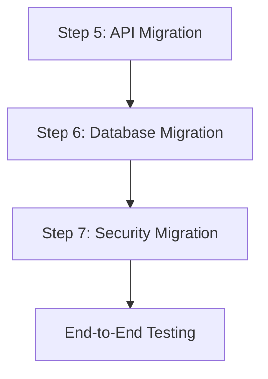

# Migration Step 5: API/Interface Migration

---

## **Step Overview and Objectives**
### **Objective**  
The purpose of this step is to port API endpoints and routing logic from the source language (C#) to the target language (Java). This includes converting request/response handlers, adapting middleware, and ensuring proper functionality and performance of the migrated API.

### **Outcomes**  
- All API endpoints are fully migrated to Java.
- Middleware is adapted to the Java ecosystem.
- The request/response handling matches the structure and behavior of the existing C# implementation.

---

## **Prerequisites and Dependencies**
### **Prerequisites**
1. The Java development environment is set up (e.g., JDK 17+).
2. A web framework is selected for the Java implementation (e.g., Spring Boot).
3. Access to the original C# API codebase.
4. Understanding of the original routing logic in C# (e.g., ASP.NET Controllers).
5. Familiarity with HTTP request/response practices in both C# and Java.

### **Dependencies**
- Java libraries for web development (e.g., Spring Boot, Jackson for JSON serialization/deserialization).
- Repository containing the C# project for reference.
- Database access libraries for both C# (e.g., Entity Framework) and Java (e.g., Hibernate).

---

## **Detailed Implementation Instructions**
### 1. **Port API Routes**
#### **Step-by-Step Instructions**
1. Examine the routing logic in the C# project.  
   Example (C# ASP.NET):
   ```csharp
   [Route("api/[controller]")]
   public class ProductsController : ControllerBase {
       [HttpGet("{id}")]
       public IActionResult GetProduct(int id) {
           var product = _productService.GetProduct(id);
           return Ok(product);
       }
   }
   ```
   
2. Map the routes to Java using the selected framework (e.g., Spring Boot).  
   Example (Java Spring Boot):
   ```java
   @RestController
   @RequestMapping("/api/products")
   public class ProductsController {
       
       @Autowired
       private ProductService productService;

       @GetMapping("/{id}")
       public ResponseEntity<Product> getProduct(@PathVariable int id) {
           Product product = productService.getProduct(id);
           return ResponseEntity.ok(product);
       }
   }
   ```
   
3. Ensure path variables (`{id}`) and query parameters are handled properly.
4. Use annotations to match HTTP methods (`GET`, `POST`, etc.).

---

### 2. **Convert Request/Response Handlers**
#### **Step-by-Step Instructions**
1. Identify the data models used in request/response payloads in C#.  
   Example (C# DTO):
   ```csharp
   public class ProductDTO {
       public int Id { get; set; }
       public string Name { get; set; }
   }
   ```

2. Create equivalent Java classes (POJOs).  
   Example (Java DTO):
   ```java
   public class ProductDTO {
       private int id;
       private String name;

       // Getters and Setters
       public int getId() { return id; }
       public void setId(int id) { this.id = id; }

       public String getName() { return name; }
       public void setName(String name) { this.name = name; }
   }
   ```
   
3. Replace C# `IActionResult` return types with `ResponseEntity` in Java.

4. Use serialization/deserialization libraries in Java (e.g., Jackson) for JSON processing.

---

### 3. **Adapt Middleware**
#### **Step-by-Step Instructions**
1. Identify middleware used in the C# API (e.g., authentication, logging).  
   Example (C# Middleware):
   ```csharp
   public void Configure(IApplicationBuilder app, IWebHostEnvironment env) {
       app.UseAuthentication();
       app.UseRouting();
       app.UseAuthorization();
   }
   ```
   
2. Implement Java equivalents using filters or interceptors.  
   Example (Java Filter for Authentication):
   ```java
   @Component
   public class AuthenticationFilter implements Filter {
       @Override
       public void doFilter(ServletRequest request, ServletResponse response, FilterChain chain)
               throws IOException, ServletException {
           // Custom authentication logic
           chain.doFilter(request, response);
       }
   }
   ```
   
3. Register middleware in the Java application context.  
   Example:
   ```java
   @Configuration
   public class WebConfig implements WebMvcConfigurer {
       @Override
       public void addInterceptors(InterceptorRegistry registry) {
           registry.addInterceptor(new AuthenticationInterceptor());
       }
   }
   ```

---

## **Code Examples and Snippets**
### **Routing in Java vs. C#**
#### C# Example:
```csharp
[HttpPost]
public IActionResult CreateProduct(ProductDTO product) {
    _productService.AddProduct(product);
    return CreatedAtAction("GetProduct", new { id = product.Id }, product);
}
```

#### Java Example:
```java
@PostMapping
public ResponseEntity<ProductDTO> createProduct(@RequestBody ProductDTO product) {
    productService.addProduct(product);
    return ResponseEntity.created(URI.create("/api/products/" + product.getId())).body(product);
}
```

---

## **Common Pitfalls and How to Avoid Them**
1. **Incorrect Mapping of HTTP Methods**  
   Ensure all HTTP methods are mapped correctly (`GET`, `POST`, etc.). Double-check annotations.
   - **Solution:** Review documentation for Spring Boot annotations.

2. **Serialization Issues**  
   C# and Java handle serialization differently. Ensure proper JSON mapping.
   - **Solution:** Use `@JsonProperty` annotations in Java to match field names.

3. **Middleware Misconfiguration**  
   Java middleware uses Filters/Interceptors instead of ASP.NET pipeline middleware.
   - **Solution:** Test filters independently before integrating them.

---

## **Testing Checklist**
- Verify that all routes return expected responses using tools like Postman or curl.
- Test serialization/deserialization for all request/response payloads.
- Confirm middleware functionality (e.g., authentication, logging) is working correctly.
- Run integration tests for the entire API layer.

---

## **Validation Criteria**
- All endpoints respond with correct status codes and payload structures.
- Middleware functions as expected without errors.
- API matches the functionality and behavior of the original C# implementation.

---

## **Troubleshooting Guide**
1. **Issue: Endpoint not reachable**  
   - **Check:** Ensure the route mapping in the controller matches the expected URL structure.
   - **Fix:** Verify `@RequestMapping` and `@PathVariable` annotations.

2. **Issue: Incorrect response data**  
   - **Check:** Confirm DTO field mapping and serialization/deserialization logic.
   - **Fix:** Use debugging tools or logs to inspect the payload.

3. **Issue: Middleware not applied**  
   - **Check:** Ensure filters/interceptors are registered in the configuration class.
   - **Fix:** Add debug statements in middleware to verify execution.

---

## **Resources and References**
- [Spring Boot Documentation](https://spring.io/projects/spring-boot)
- [ASP.NET Core Documentation](https://learn.microsoft.com/en-us/aspnet/core/)
- [Jackson JSON Library](https://github.com/FasterXML/jackson)

---

## **Next Steps**
After completing API migration:
1. Migrate database access logic (Step 6: Database Migration).
2. Implement security features (Step 7: Security Migration).
3. Perform end-to-end testing with the complete migrated application.

---



---

## **Time Estimate**
- Port API Routes: 6-8 hours
- Convert Request/Response Handlers: 4-6 hours
- Adapt Middleware: 4-6 hours
- Testing and Validation: 4-5 hours  
**Total: 18-25 hours**